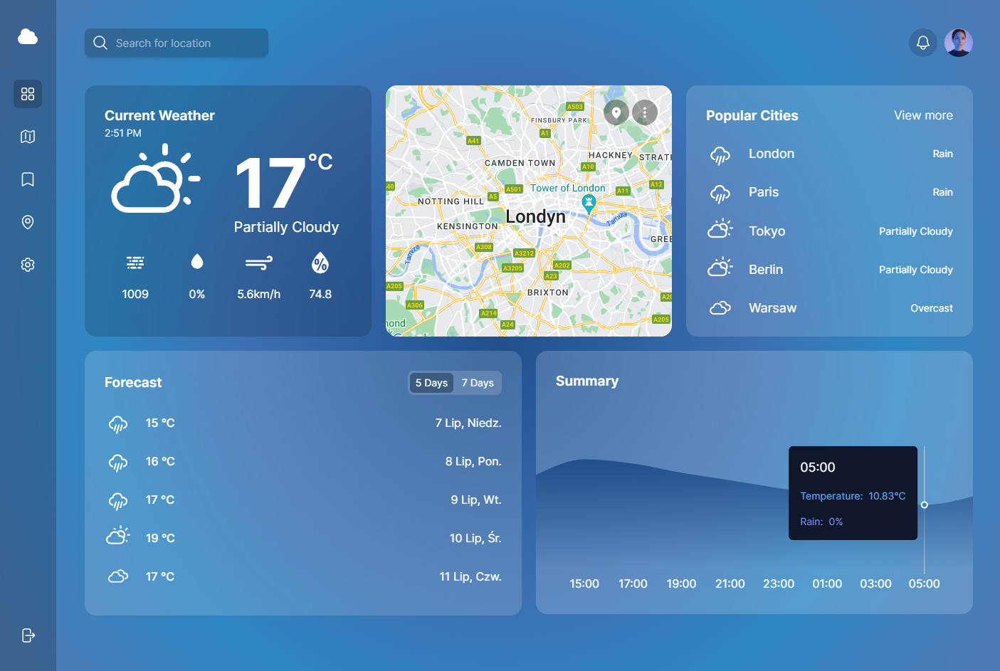

# Weather App

Welcome to the Weather App! This application allows you to check the weather in cities around the world. You can search for any city and get detailed weather information. The app is responsive and uses the Weather API by Visual Crossing and Google Maps for its functionalities.

#### Login
Email: admin@weather.app
Password: Admin1234!

## Live Demo

- Frontend Hosting: [Weather App](https://weather-app-thaikoz.netlify.app/)
- Repository: [GitHub Repository](https://github.com/ThaikoZ/weather-app)

 <!-- Add the correct path to your demo image -->

## Features

- **Global Weather Search**: Find weather information for cities worldwide.
- **7-Day Forecast**: View the weather forecast for the next 7 days.
- **18-Hour Temperature Chart**: Visualize temperature trends for the next 18 hours.
- **Responsive Design**: Optimized for both desktop and mobile devices.
- **TODO: User Authentication**: Create an account or login with existing credentials.
- **Session Management**: User sessions expire after 30 minutes for security.

## Getting Started

### Prerequisites

To run this project, you need to have:

- Node.js installed on your machine
- An account with Visual Crossing for the Weather API key
- Google Maps API key

### Installation

1. Clone the repository:

   ```bash
   git clone https://github.com/ThaikoZ/weather-app.git
   cd weather-app
   ```

2. Install dependencies:

   ```bash
   npm install
   ```

3. Create a `.env` file in the root directory and add your API keys:

   ```bash
   VITE_WEATHER_API_KEY="your_visual_crossing_api_key"
   VITE_GOOGLE_MAPS_API_KEY="your_google_maps_api_key"
   ```

### Running the App

To start the development server, run:

```bash
npm run dev
```

Open [http://localhost:3000](http://localhost:3000) to view it in the browser.

### Build

To create a production build, run:

```bash
npm run build
```

### Deploy

You can deploy the app to any static site hosting service, such as Netlify.

## Usage

### Authentication

- **Login**: Use the credentials `admin@weather.app` and password `Admin1234!`, or register a new account.
- **Registration**: Provide your email and password to create a new account.

### Weather Search

1. Enter the name of the city in the search bar.
2. View the current weather, 7-day forecast, and an 18-hour temperature chart for the selected city.

### State Management

User details and application state are managed using Redux.

## Technologies Used

- **Frontend**: React, TypeScript
- **State Management**: Redux
- **Charts**: Recharts
- **Forms**: React Hook Form
- **API**: Visual Crossing Weather API, Google Maps API
- **Hosting**: Netlify

## License

This project is licensed under the MIT License - see the [LICENSE](LICENSE) file for details.

---

Feel free to contribute to this project by submitting issues or pull requests. Happy coding!

---
